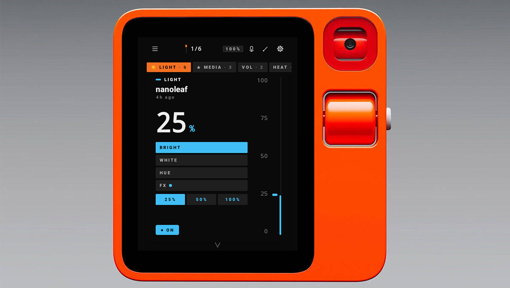

# R1HA: A native Kotlin Home Assistant client, designed for small screens



A native Home Assistant client originally built for the Rabbit R1, and equally at home on any Android 11+ phone or tablet. On the R1 the physical scroll wheel adjusts every scalar HA entity (light brightness, fan speed, cover position, media volume); on touch devices the same controls respond to drag and tap.

Where the official [Home Assistant Companion app](https://github.com/home-assistant/android) is fundamentally a WebView wrapped around HA's Lovelace frontend, this client renders everything natively in a Compose-first idiom and falls back to a Lovelace WebView only for the long tail that doesn't fit (HACS cards, automation editor, configuration panel). The card stack + scroll-wheel idiom is tuned for the R1's portrait display, but the layout adapts cleanly to handheld phones, wall-mounted tablets, and kiosk installs; touch replaces the wheel without the UI feeling like an afterthought. The trade-off: this client requires Android 11 or newer, where the official Companion app reaches back to Android 8.

---

## Features

### Awareness: *the at-a-glance surfaces*

- **TODAY dashboard**: single screen with time-of-day greeting, current outdoor weather (with condition glyph + temperature), sun position (above/below horizon, next rise/set), active **HA timers** with remaining time, currently-playing media with **prev/play/next transport**, who's home, the next calendar event, **DRAW** (total power consumption summed from every power-class sensor), **LIGHTS ON / CAMERAS / ALERTS** metrics row, a **BATTERIES LOW** alert card surfaced when any battery sensor drops below 20%, and a preview of any HA persistent alerts. Pull-to-refresh; auto-refreshes every 60 s. Reachable from Settings → Dashboard or from Quick Actions (long-press hamburger). Can be set as the launch screen for kiosk-style installs via *Settings → Behaviour → Start on Dashboard*.
- **Quick Search**: substring search across every HA entity (name / entity_id / area), with **ALL / CONTROLS / SENSORS / ACTIONS** filter chips. Tap a result to fire (scenes / scripts / buttons), toggle (lights / switches / etc.) or surface a detail toast (sensors). Long-press to drill into that entity's `/history` view in HA's web UI. Settings → Quick Search.
- **Cameras**: live polling snapshots from every `camera.*` entity. LIST view shows the directory + state chip; GRID view shows 2-column polling tiles with 8 s cadence. Tap any camera for a fullscreen overlay at 4 s polling cadence.
- **Weather**: every `weather.*` entity with condition glyph (☀ ⛅ ☁ ☂ ❄ ⚡ …), temperature, humidity, wind, pressure, and a 7-day daily forecast strip when HA exposes the legacy `forecast` attribute.
- **Who's home**: `person.*` + `device_tracker.*` in one directory, home / away coloured per state, with GPS-accuracy chip and source-type chip on device_trackers.
- **Calendars**: `calendar.*` entities with NOW pill for currently-happening events. Tap a row to drill into the next 14 days of events via HA's `/api/calendars/<id>` endpoint.
- **Recent Activity**: HA's logbook reverse-chronologically, 12 h / 24 h / 3 d windows, full-text search. Tap a row to drill into that entity's history; long-press to open it in HA's web UI.
- **Notifications**: every `persistent_notification.*` entity with title, message, timestamp, and DISMISS chip. Auto-refreshes every 30 s while open.
- **Areas**: HA's area registry with entity count per area, expandable rows showing the full entity list. Powered by a server-side Jinja template against `/api/template`.
- **Zones**: `zone.*` registry with an abstract Canvas map at the top (each zone a circle sized by its radius, positioned by its lat/lon, occupied zones filled in accent), plus a per-zone occupancy list (which persons / device_trackers are in each zone right now). An OUTSIDE bucket collects `not_home` people.
- **Energy**: DRAW (sum of every `device_class=power` sensor), PRODUCTION (heuristic sum of solar / pv / grid_export / production sensors), TODAY's kWh (sum of `device_class=energy` `total_increasing` sensors), and the top 5 current consumers ranked by W draw. Native: no WebView, no Lovelace bundle.
- **History drill-in**: full-screen view of any entity's recent state-change history, with a 1 h / 6 h / 24 h / 7 d window picker, a 180-dp Compose Canvas chart with explicit min/max axis labels, and a 5-row numeric summary (current / min / max / avg / sample count). Reachable via the 📈 glyph on Search rows OR by tapping any row in Recent Activity.

### Control: *the things you act on*

- **Scroll wheel control**: spin to adjust any scalar HA entity (lights, fans, covers, media players). Spring-animated slider gives a satisfying overshoot-and-settle on each turn.
- **Card stack UI with tabs**: one full-screen card per favourite entity; swipe up/down to flip between them, swipe left/right (or wheel-flick) to switch between rearrangeable tab groups.
- **HA Assist**: type or 🎤 dictate a prompt and HA's conversation engine handles it; multi-turn context threaded across calls. The mic button uses the system speech recognizer so no `RECORD_AUDIO` permission is needed.
- **Scenes & Scripts launcher**: tap-fire access to every `scene.*` / `script.*`, with substring search, kind filter chips, pull-to-refresh, and long-press for the `entity_id` + service name.
- **Automations**: list of every `automation.*` entity with enabled-state chip, mode badge (single / parallel / queued / restart), running-instance count, and a relative `last_triggered` timestamp. Tap to toggle enable/disable; tap the right-edge **RUN** to fire `automation.trigger` with `skip_condition: true`; ★ to pin to the card stack. **RELOAD** chip in the top bar fires `automation.reload`.
- **Helpers**: every HA helper domain (`input_boolean` toggles, `input_number` steppers, `counter`, `input_select` cycle-through-options, `input_text` / `input_datetime` read-only, `input_button` press, `timer` start/pause/cancel). Bucket-chip filters at the top group by helper kind; ★ pins frequently-used helpers to the card stack.
- **Master OFF actions**: one-tap mass off for *all lights*, *all media*, or *all switches* from the Scenes & Scripts screen. HA's `entity_id: "all"` trick under the hood.
- **Quick Actions drawer** (long-press chrome hamburger): also doubles as the navigation drawer with a 2×4 BROWSE grid (Today · Assist · Search · Scenes · Automations · Energy · Alerts), so every major surface is one long-press + one tile-tap away.
- **App shortcuts** (long-press launcher icon): Search · Assist · Today · Automations land directly on those surfaces.
- **Quick Settings tiles**: bind up to four HA entities to Android's notification-shade quick-settings panel; each tile toggles its bound entity from anywhere on the phone without opening the app. Configured via *Settings → Behaviour → Quick Settings tile* (slots A through D).

### Power tools: *for the long tail*

- **Templates evaluator**: POST a Jinja2 template to HA's `/api/template` and render against live state. Side-by-side example chips (Sun elevation, On lights count, Unavailable, Areas) for one-tap discovery. RECENT history recalls past renders; tap COPY to write the result to the clipboard.
- **Service Caller**: fire any HA service (`automation.reload`, `homeassistant.check_config`, `persistent_notification.create`, …) without leaving the device. JSON data payload editor with PASTE chip, RECENT history, result panel with copy-to-clipboard.
- **Services Browser**: discoverable directory of every service HA exposes via `/api/services`, grouped by domain, with substring search and tap-to-copy to populate the Service Caller.
- **Updates**: surface every HA `update.*` entity (HA Core, Supervisor, OS, add-ons, integration firmware) with installed→latest version diff, release notes, AUTO badge for entities with `auto_update` enabled, and a one-tap INSTALL action (with optional pre-install backup for CORE entries).
- **Repairs**: HA's repairs/issues feed (the same set the HA frontend shows under Settings → System → Repairs). Severity-coloured rows; IGNORE / RESTORE buttons fire `repairs/ignore` server-side. Pulled live over the WebSocket.
- **Backups**: list every backup HA's `backup/info` endpoint knows about (HA Core 2024.4+) with name, timestamp, size, and protected flag; CREATE BACKUP NOW button fires `backup.create` and refreshes the list once HA writes the new backup.
- **Media Browse**: navigate any media_player's library via `media_player/browse_media`. Type the entity_id, drill into folders, tap to play on the bound player.
- **System Health**: HA's `/api/config` (version, location, timezone, components, internal/external URLs), a NETWORK SECURITY panel showing the current TLS pinning + mTLS state, an inline PING chip that measures round-trip latency to `/api/config`, and the last ~32 KB of `/api/error_log`. COPY chip writes the full log to the clipboard for bug reports.
- **Lovelace WebView**: in-app fallback to HA's own frontend for features we don't render natively (HACS custom cards, automation visual editor, full configuration panel). Token handoff via injected `localStorage.hassTokens` so no second OAuth round-trip. System back navigates the WebView's history first; only falls through to popBackStack when there's no history left.
- **External automation intent**: Tasker / MacroDroid / Automate can fire HA service calls through this app by broadcasting `com.github.itskenny0.r1ha.action.HA_SERVICE_CALL` with `ha_domain` / `ha_service` / `ha_entity_id` / `ha_data_json` extras. Opt-in via Dev menu so the surface stays closed on fresh installs.
- **HA notification mirror**: opt-in posting of HA persistent_notifications into the Android system notification shade, with a DISMISS action that fires `persistent_notification.dismiss` server-side.
- **Live template subscriptions**: Templates screen has a LIVE toggle that subscribes to HA's `render_template` WS command. Every state change that affects the template re-renders in place.
- **Live activity tail**: Recent Activity screen has a TAIL toggle that subscribes to HA's `logbook_entry` event stream. New entries prepend in real time while the REST window query still backs the initial fill.
- **NFC tag scanning**: opt-in foreground reader. Tap an NFC tag against the device while R1HA is open and the app fires HA's `tag_scanned` event with the tag UID as `tag_id`.
- **iBeacon advertiser**: opt-in BLE peripheral that broadcasts as an iBeacon (configurable UUID + major + minor). HA's iBeacon integration picks the device up as a device_tracker for presence / proximity automations.
- **Zigbee pairing**: opens the network for joins on whichever Zigbee backend HA is using (ZHA, Zigbee2MQTT, or deCONZ), surfaces newly-discovered entities as they enrol, and lets you rename + assign an area from a single sheet without leaving the app.
- **Webhook receiver**: opt-in foreground TCP listener. HA's webhook automations can POST at `http://<device-ip>:<port>/webhook/<id>` and the body shows up as an expandable toast. Useful for triggering on-device feedback from a server-side rule.
- **MQTT publish**: one-shot client that connects to any broker, fires a single publish (configurable topic, payload, retain flag, TLS, auth), and disconnects. Implemented by hand so the APK doesn't pick up a daemon-style dependency for what's really a fire-and-forget message.
- **Voice satellite**: push-to-talk surface that pipes mic audio at HA's assist pipeline (STT, conversation, TTS) over the existing WebSocket and plays the response. No wake-word yet; that needs an on-device model and is a separate cycle's work.
- **Home-screen widget**: single-tile launcher widget. Tap to open the app, drop it anywhere on your launcher for one-touch access.
- **Background entity-cache refresh**: opt-in JobService warms the entity cache every ~15 min while the app is closed so Quick Tile state and cold-start paint stay fresh.
- **Long-lived access token entry**: alternative to OAuth for kiosk-style R1s. Paste an HA long-lived access token; stored encrypted at rest with the same AndroidKeystore-wrapped AES-256/GCM key as OAuth tokens.
- **Gesture-first navigation**: swipe left for Settings, right for the Favourites picker, tap the value area to toggle on/off; small chevron-back buttons on every sub-screen plus full system-back support.
- **OAuth sign-in**: enter your HA URL once and authenticate in an in-app WebView; tokens encrypted at rest with an AndroidKeystore-wrapped AES-256/GCM key.
- **Three themes**: *Pragmatic Hybrid* (default), *Minimal Dark*, *Colourful Cards*. Switch live in Settings with a side-by-side preview.
- **Backup & restore**: export/import your favourites, tabs, and settings as a single JSON file from Settings.
- **Fully configurable**: wheel step (1/2/5/10%) and acceleration, haptics, keep-screen-on, display mode, on/off pill, area labels, position dots.
- **Built for the R1, scales beyond it**: designed around the R1's small portrait display and physical scroll wheel (handles both `DPAD_UP/DOWN` and `VOLUME_UP/DOWN` keycodes so it works across ROM variants); on phones and tablets the same layout responds to touch + gesture so the wheel-less devices don't feel like an afterthought.

## Requirements

- **Android 11 or newer** on any phone, tablet, or wall-mounted kiosk display.
- The **Rabbit R1** (primary target) running **LineageOS 21 GSI** (Android 14) or **CipherOS** (Android 16).
- A reachable **Home Assistant** instance (local network or remote URL).
- For sane UI scaling on R1 LineageOS GSI: `adb shell wm density 180`.

## Install

Download the latest `r1ha-YYYY.MM.DD.apk` from the [Releases](../../releases) page and install:

```bash
adb install r1ha-YYYY.MM.DD.apk
```

Or copy the APK to the device and open it with a file manager.

## Build from source

**Prerequisites:** JDK 17+, Android SDK with `platforms;android-35` and `build-tools;35.0.0`.

```bash
git clone https://github.com/itskenny0/Rabbit-R1-HA.git
cd Rabbit-R1-HA
./gradlew :app:assembleDebug
adb install app/build/outputs/apk/debug/app-debug.apk
```

The local build uses today's date as the version (`YYYYMMDD` for `versionCode`, `YYYY.MM.DD` for `versionName`); CI passes `APP_VERSION_CODE` / `APP_VERSION_NAME` from the release tag.

## Releasing

Releases are date-tagged. Push a tag in the form `r1ha-YYYYMMDD`:

```bash
git tag "r1ha-$(date +%Y%m%d)"
git push origin "r1ha-$(date +%Y%m%d)"
```

The release workflow builds the APK, renames it to `r1ha-YYYY.MM.DD.apk`, generates release notes from `git log` since the previous tag, and attaches the APK to a stable GitHub Release; no keystore management or repository secrets required.

## License

Released into the public domain via [The Unlicense](LICENSE).
