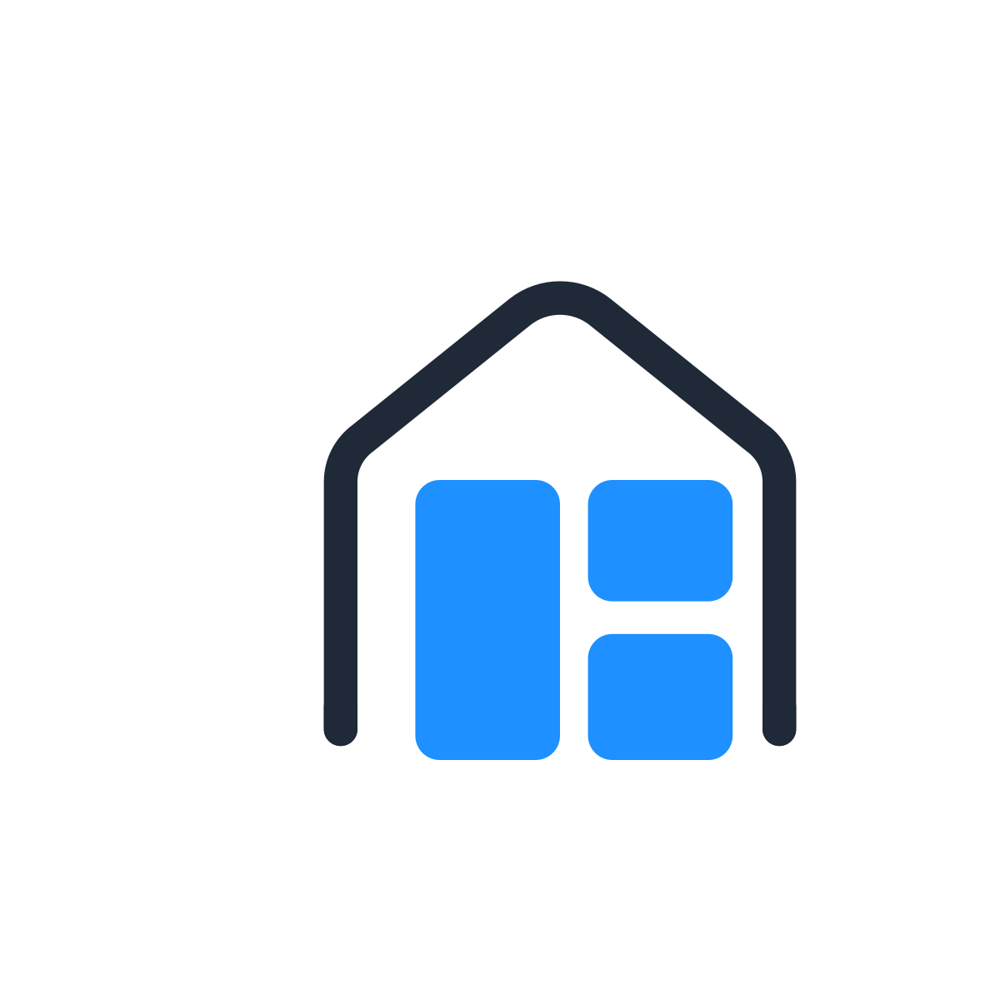
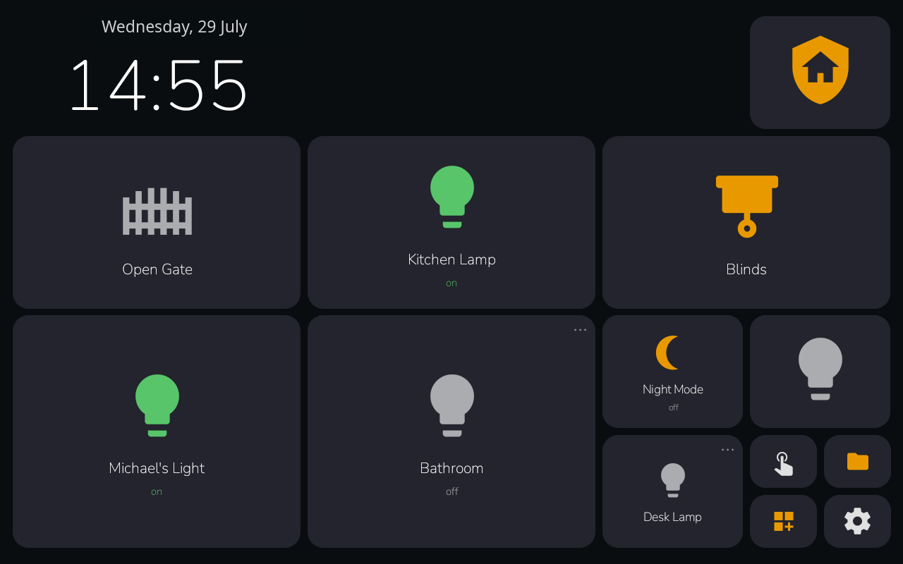
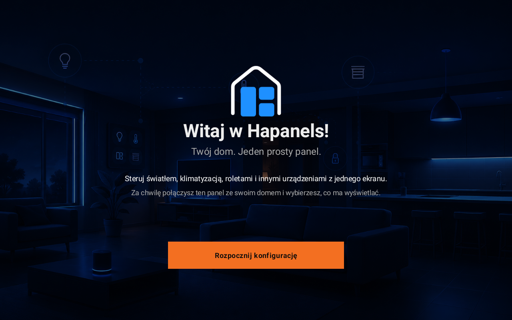
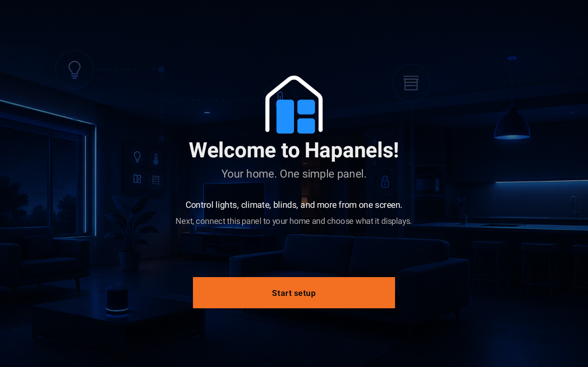
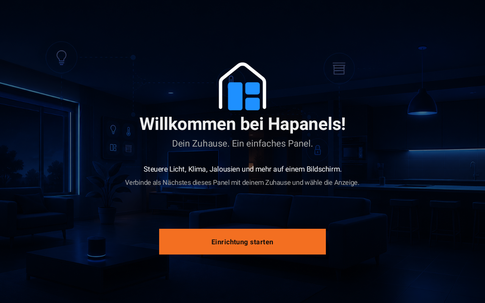
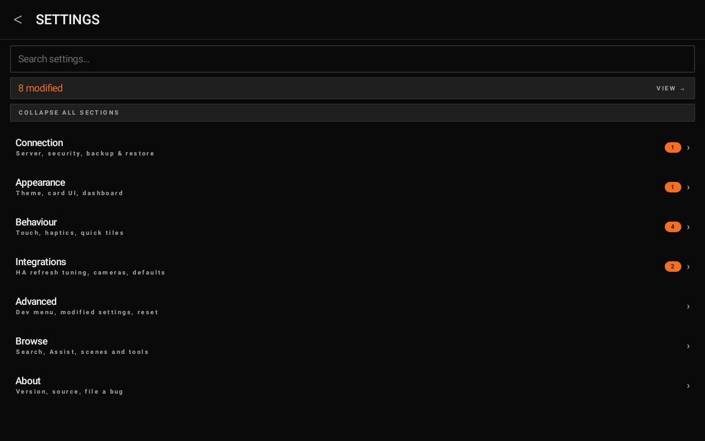

# Hapanels

[](https://github.com/tw-zs/Hapanels/actions/workflows/ci.yml)
[](https://tw-zs.github.io/Hapanels/)
[](https://github.com/tw-zs/Hapanels/releases)
[](https://github.com/tw-zs/Hapanels/blob/main/LICENSE)

<p align="center">
  
</p>

Hapanels is a native Android Home Assistant wall-panel app for Shelly Wall Display devices and larger Android tablets.

It is not a Lovelace WebView wrapper. The app renders its own Compose UI, talks to Home Assistant through the native REST/WebSocket APIs, and exposes panel hardware back to Home Assistant through MQTT discovery.

Docs site: <https://tw-zs.github.io/Hapanels/>

<p align="center">
  
</p>

### App Preview

<p align="center">
  
  
</p>
<p align="center">
  
  
</p>

[View the complete screenshot gallery](https://tw-zs.github.io/Hapanels/en/screenshots/).

## What Works Now

- Native Home Assistant entity cards and a panel-style dashboard.
- Shelly Wall Display detection with a generic Android tablet fallback.
- Shelly relay, ambient light, brightness, button, and proximity presence support where the hardware exposes it.
- MQTT discovery/state/command topics for panel controls and diagnostics.
- Proximity wake, touch wake, auto-brightness, and a native AOD/screensaver.
- Guided Home Assistant onboarding with OAuth or long-lived token setup, tablet naming, and native start-view/theme choices.
- Polish-first panel UI for the tablet/Shelly use case.

## Project Direction

- Home Assistant owns configuration, entity state, and dashboard data.
- Hapanels renders that data natively on Android.
- Hardware features are exposed only when they are real and verified. No fake temperature, humidity, or proximity sensors.
- Camera support is planned as a native Compose viewer, not a WebView shortcut.

## AI Usage

- AI helps with coding, review, docs, and release notes.
- Mostly used GPT for coding, Gemini for Studio frontend and Mistral helped a bit with translations. 

## Install

Download the latest APK from [GitHub Releases](https://github.com/tw-zs/Hapanels/releases).

For Shelly Wall Display testing, install the GitHub APK and grant write-settings access after install if brightness control is needed:

```bash
adb install -r -d app-github-debug.apk
adb shell appops set com.github.twzs.hapanels android:write_settings allow
```

## Development Build

Requirements:

- JDK 17
- Android SDK with API/build tools used by the Gradle project

Build a debug APK:

```bash
./gradlew --no-daemon -Dkotlin.compiler.execution.strategy=in-process :app:assembleGithubDebug
```

Run the screen-manager regression tests:

```bash
./gradlew --no-daemon -Dkotlin.compiler.execution.strategy=in-process :app:testGithubDebugUnitTest --tests com.github.itskenny0.r1ha.core.hardware.PanelScreenManagerTest
```

## Documentation

- [Roadmap](docs/ROADMAP.md)
- [Screenshot gallery](docs/screenshots.en.md)
- [GitHub Pages site](https://tw-zs.github.io/Hapanels/)

## Attribution

- Native Home Assistant client base: [R1HA](https://github.com/itskenny0/R1HA), Unlicense.
- Shelly hardware reference: [ShellyElevate](https://github.com/RapierXbox/ShellyElevate), Apache-2.0.

See [NOTICE.md](NOTICE.md) for details.
